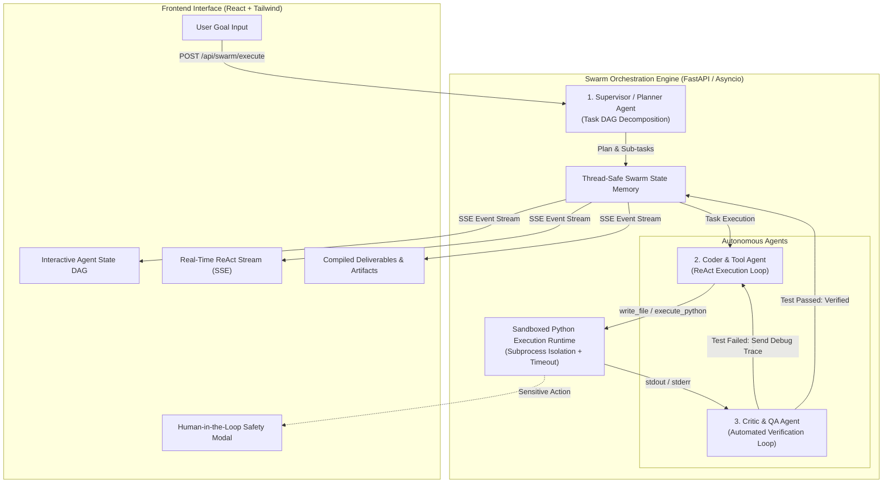

# 🤖 NexusSwarm: Autonomous Multi-Agent Research & Code Analysis Swarm

[](https://www.python.org/)
[](https://fastapi.tiangolo.com/)
[](https://reactjs.org/)
[](https://react-lm.github.io/)
[](https://developer.mozilla.org/)
[](LICENSE)

> A stateful, production-grade **Autonomous Multi-Agent Orchestration Swarm** engineered with a **Supervisor-Worker-Critic** hierarchy, tool-calling ReAct loops, sandboxed Python code execution, and self-correcting feedback mechanisms.

---

## 📌 Problem Statement

Standard, single-turn LLM wrappers fail at non-trivial software engineering tasks:
1. **Hallucination & Syntax Errors**: Single-shot LLMs produce code that fails at runtime without realizing it.
2. **Lack of Feedback Loops**: Standard chatbots cannot execute the code they write, inspect `stderr`, and fix their own mistakes.
3. **Black-Box Execution**: Users cannot observe the intermediate reasoning trace or intervene when sensitive operations are attempted.

**NexusSwarm** solves this by orchestrating specialized AI agents that plan, write, execute, test, and critique code in an isolated sandboxed environment.

---

## 🏗️ System Architecture



---

## ⚡ Core Engineering Highlights

### 1. Autonomous Supervisor-Worker-Critic Triad
* **Supervisor Agent**: Deconstructs high-level software goals into a directed acyclic graph (DAG) of actionable sub-tasks.
* **Coder Agent**: Implements modular code and unit test suites, invoking tools through an extensible **ReAct (Reason $\rightarrow$ Act $\rightarrow$ Observe $\rightarrow$ Reflect)** cycle.
* **Critic Agent**: Acts as an independent quality assurance gatekeeper. It executes tests in the sandbox, inspects assertion outputs, and either signs off or rejects the deliverables.

### 2. Self-Healing Code Execution & Feedback Loop
* If a script encounters a runtime error (`stderr`) or a test failure, the Critic Agent captures the traceback, synthesizes actionable debugging instructions, and re-triggers the Coder Agent in a closed-loop cycle (up to $N$ iterations) until all tests pass.

### 3. Isolated Sandboxed Tool Runtime
* Safe execution engine that runs generated Python code in isolated subprocesses with enforced execution timeouts (preventing infinite loops) and clean `stdout`/`stderr` capture.

### 4. Real-Time Streaming Reasoning Trace (SSE)
* Granular Server-Sent Events (SSE) streaming broadcasting agent thoughts, active tool parameters, raw terminal outputs, and state transitions to the browser with sub-100ms latency.

### 5. Human-in-the-Loop Safety Gateway
* Built-in security gatekeeper that automatically pauses agent execution and requests one-click human authorization before executing sensitive shell commands or file operations.

---

## 🚀 Quick Start & Installation

### Prerequisites
* Python 3.10+
* Node.js 18+

### 1. Install Dependencies

```bash
# Install Python backend requirements
cd server
pip install -r requirements.txt

# Install React frontend dependencies
cd ../client
npm install
```

### 2. Start the Full Swarm (One Command)

From the project root directory:
```bash
python run-dev.py
```

* **Frontend Dashboard**: [http://localhost:5173](http://localhost:5173)
* **Backend API Documentation**: [http://localhost:8000/docs](http://localhost:8000/docs)

---

## 💼 Resume / CV Bullet Points (Ready to Copy-Paste)

```markdown
NexusSwarm: Autonomous Multi-Agent Research and Code Analysis Swarm
Technologies: Python, FastAPI, React 18, Asyncio, Pydantic, WebSockets, Docker, Tailwind CSS

• Architected an autonomous multi-agent engineering swarm utilizing a supervisor-worker-critic hierarchy and ReAct tool-calling loops to automate complex software development workflows.
• Engineered a self-healing code execution engine with sandboxed runtime isolation, automatically capturing traceback errors and re-triggering targeted debugging cycles.
• Designed a real-time Server-Sent Events streaming pipeline broadcasting sub-100ms agent reasoning traces and dynamic task dependency graph state transitions.
• Integrated a human-in-the-loop permission gateway enforcing safety constraints on sensitive tool execution while supporting multi-provider LLM orchestration.
```

---

## 📄 License
MIT License. Built for educational portfolio and advanced LLM systems engineering demonstration.
